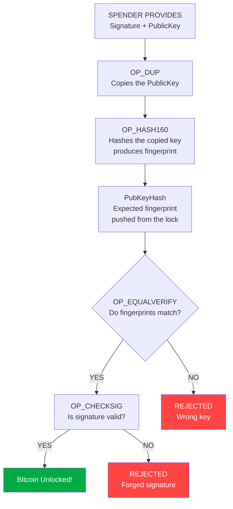

# Assignment A: P2PKH Bitcoin Script Analysis

## Given Script
OP_DUP OP_HASH160 <PubKeyHash> OP_EQUALVERIFY OP_CHECKSIG

This script is called P2PKH (Pay-to-Public-Key-Hash).
It is the most common Bitcoin locking script.
Think of it as a locked box, only the person with the correct key and signature can open it.

---

## Task 1: Opcode Breakdown

When someone wants to spend Bitcoin locked with this script, they provide their Public Key and Signature.
The script then processes them step by step using a stack (like a pile of items).

| Step | Opcode | What It Does Simply |
|------|--------|----------------------|
| 1 | OP_DUP | Makes a copy of the public key provided by the spender |
| 2 | OP_HASH160 | Scrambles the copied public key into a short fingerprint |
| 3 | PubKeyHash | Pushes the expected fingerprint stored in the lock onto the stack |
| 4 | OP_EQUALVERIFY | Checks if the two fingerprints match, stops and rejects if they do not |
| 5 | OP_CHECKSIG | Verifies the digital signature using the original public key |

### Stack Walkthrough

Start:          [Signature, PublicKey]
OP_DUP:         [Signature, PublicKey, PublicKey]
OP_HASH160:     [Signature, PublicKey, Hash(PublicKey)]
PubKeyHash:     [Signature, PublicKey, Hash(PublicKey), PubKeyHash]
OP_EQUALVERIFY: [Signature, PublicKey]  hashes matched, continues
OP_CHECKSIG:    [TRUE]                  signature valid, Bitcoin unlocked!

---

## Task 2: Data Flow Diagram

## Task 3: What Happens If Signature Verification Fails

There are two points where failure can occur:

### Failure at OP_EQUALVERIFY (wrong public key)
- The script halts immediately
- OP_CHECKSIG is never reached
- The transaction is rejected by every node on the network
- The Bitcoin remains locked and unspent
- The UTXO (unspent output) is preserved exactly as before

### Failure at OP_CHECKSIG (wrong signature)
- The script returns FALSE
- The transaction is rejected by the network
- No funds are moved
- Every node independently enforces this rule without any central authority
- In both cases the Bitcoin stays locked, no partial transfers happen

---

## Task 4: Security Benefits of Hash Verification

### Why hash the public key instead of storing it directly?

1. Shorter and Cleaner Addresses
   - A raw public key is 33 to 65 bytes long
   - A HASH160 fingerprint is only 20 bytes
   - This makes Bitcoin addresses shorter and easier to share safely

2. Two Layers of Cryptographic Protection
   - To steal funds an attacker must BOTH:
     a) Reverse the HASH160 to find the public key (computationally impossible)
     b) Then forge a valid ECDSA signature for that key (also computationally impossible)
   - Breaking one layer is not enough, both must be broken simultaneously

3. Quantum Computing Protection
   - Your public key is hidden behind the hash until you spend
   - Even if quantum computers broke elliptic curve cryptography in the future
     the hash provides an extra barrier since the key is never exposed until spending
   - Using a fresh address each time minimises the window of exposure

4. Early Error Detection
   - OP_EQUALVERIFY catches wrong keys immediately at Step 4
   - The network does not waste resources running OP_CHECKSIG on wrong inputs
   - This makes validation faster and more efficient across all nodes

5. Privacy Through Abstraction
   - The recipient shares only a hashed address, never their raw public key
   - The public key is only revealed when spending
   - This limits how much information is exposed to observers of the blockchain